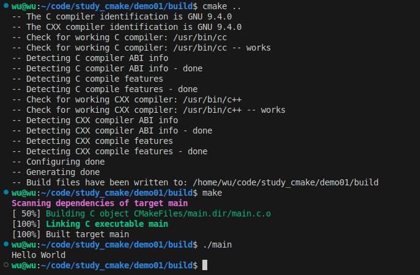
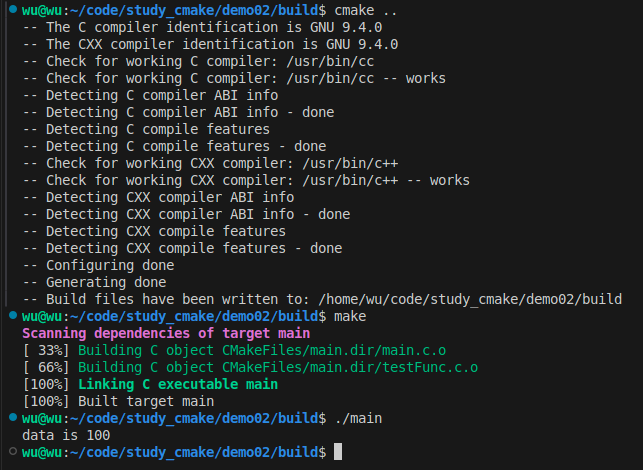
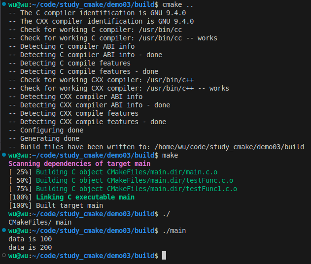
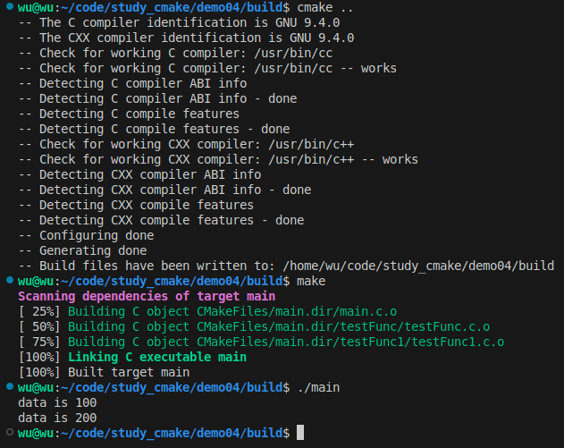
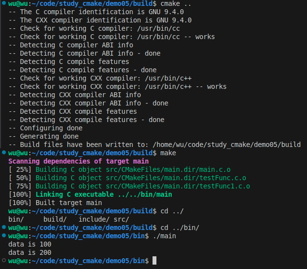
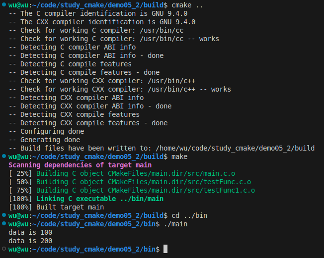
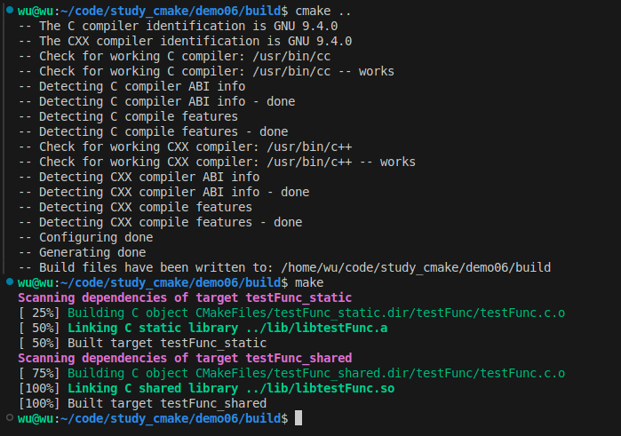
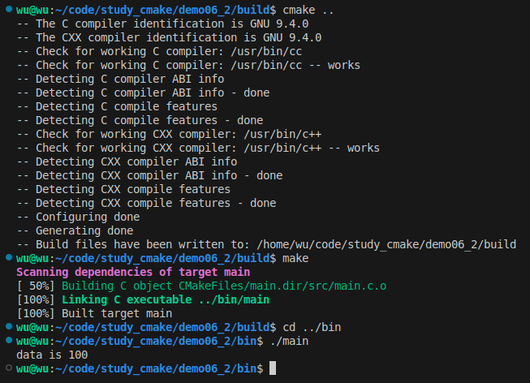

# 前言
写这个的目的是为了学习CMake，顺便记录一下学习过程。

里面的代码都是这篇博客的，我就是将博客里的代码复制了一遍，放在了github上。

[https://blog.csdn.net/weixin_43717839/article/details/128032486](https://blog.csdn.net/weixin_43717839/article/details/128032486)


代码有需要的自取。

## demo01
使用tree查看目录结构
```bash
wu@wu:~/code/study_cmake/demo01$ tree -L 1
.
├── build
├── CMakeLists.txt
└── main.c

1 directory, 2 files
```

如何编译链接
```shell
cd build
cmake ..
make
```
如何使用
```shell
./main
```


## demo02

```bash
wu@wu:~/code/study_cmake/demo02$ tree
.
├── build
├── CMakeLists.txt
├── main.c
├── testFunc.c
└── testFunc.h

1 directory, 4 files
```



## demo03
可以类推，如果在同一目录下有多个源文件，那么只要在add_executable里把所有源文件都添加进去就可以了。

但是如果有一百个源文件，再这样做就有点坑了，无法体现cmake的优越性。
因此cmake提供了一个命令可以把指定目录下所有的源文件存储在一个变量中，这个命令就是
```cmake        
aux_source_directory(dir var)
```
第一个参数dir是指定目录，第二个参数var是用于存放源文件列表的变量。

在demo03目录的CMakeLists.txt中可以看到：

1. 使用aux_source_directory把当前目录下的源文件存列表存放到变量SRC_LIST里;

2. 然后在add_executable里调用SRC_LIST（注意调用变量时的写法）。

---

**aux_source_directory()也存在弊端，它会把指定目录下的所有源文件都加进来，可能会加入一些我们不需要的文件，此时我们可以使用set命令去新建变量来存放需要的源文件，如下：**
```cmake
cmake_minimum_required (VERSION 2.8)

project (demo)

set( SRC_LIST
	 ./main.c
	 ./testFunc1.c
	 ./testFunc.c)

add_executable(main ${SRC_LIST})
```


## 在不同目录下有多个源文件(demo04)

目录结构如下：
```bash
wu@wu:~/code/study_cmake/demo04$ tree
.
├── build
├── CMakeLists.txt
├── main.c
├── testFunc
│   ├── testFunc.c
│   └── testFunc.h
└── testFunc1
    ├── testFunc1.c
    └── testFunc1.h

3 directories, 6 files
```

这里出现了一个新的命令：include_directories。

该命令是用来向工程添加多个指定**头文件**的搜索路径，路径之间用空格分隔。

因为main.c里include了`testFunc.h`和`testFunc1.h`，如果没有这个命令来指定头文件所在位置，就会无法编译。当然，最传统的方式也可以在`main.c`里使用`include`来指定路径，如下
```cpp
#include "test_func/testFunc.h"
#include "test_func1/testFunc1.h"
```
只是这种写法不好看。
另外，我们使用了2次aux_source_directory，因为源文件分布在2个目录下，所以添加2次。



## 项目级的组织结构(demo05)
正规一点来说，一般会把源文件放到src目录下，把头文件放入到include文件下，生成的对象文件放入到build目录下，最终输出的可执行程序文件会放到bin目录下，这样整个结构更加清晰。
```bash
wu@wu:~/code/study_cmake/demo05$ tree
.
├── bin
├── build
├── CMakeLists.txt
├── include
│   ├── testFunc1.h
│   └── testFunc.h
└── src
    ├── main.c
    ├── testFunc1.c
    └── testFunc.c

4 directories, 6 files
```
cmakeLists.txt内容添加了下面这一行新内容：

**add_subdirectory：这个语句的作用是增加编译子目录。其基本语法格式是：**
```cmake
add_subdirectory(source_dir [binary_dir] [EXCLUDE_FROM_ALL])
```
一共有三个参数，后两个是可选参数.

1. source_dir 源代码目录

指定一个包含CMakeLists.txt和代码文件所在的目录，该目录可以是绝对路径，也可以是相对路径，对于后者相对路径的起点是CMAKE_CURRENT_SOURCE_DIR。此外，如果子目录再次包含的CMakeLists.txt，则将继续处理里层的CMakeLists.txt，而不是继续处理当前源代码。

2. binary_dir 二进制代码目录

这个目录是可选的，如果指定，cmake命令执行后的输出文件将会存放在此处，若没有指定，默认情况等于source_dir没有进行相对路径计算前的路径，也就是CMAKE_BINARY_DIR。

3. EXCLUDE_FROM_ALL标记

这个标志是可选的，如果传递了该参数表示新增加的子目录将会排除在ALL目录之外（可能是make系统中的make all？），表示这个目录将从IDE的工程中排除。用户必须显式在子文件这个编译目标（手动cmake之类的）。指定了这个文件夹，表示这个文件夹是独立于源工程的，这些函数是有用但是不是必要的，比如说我们一系列的例子。

add_subdirectory 这个命令用于添加源文件子目录，同时还可以指定中间二进制和目标二进制的生成路径。EXCLUDE_FROM_ALL将会将这个目录从编译中排除，如工程的例子需要等待其他编译完成后再进行单独的编译。通常子目录应该包含自己的project()命令，这样以来整个编译命令将会产生各自的目标文件。如果把CMakeLists.txt与VS IDE比较，总的CMakeLists.txt就相当于解决方案，子CMakeLists.txt就相当于在解决方案下的工程文件。还有一个需要注意的是，如果编译父CMakeLists时依赖了子CMakeLists.txt中的源文件，那么该标志将会被覆盖（也就是也会处理），以满足编译任务。

---
这里指定src目录下存放了源文件，当执行cmake时，就会进入src目录下去找src目录下的CMakeLists.txt，所以在src目录下也建立一个CMakeLists.txt，内容如下:

src/CMakeLists.txt


这里的set其实是和前面的一样，只是EXECUTABLE_OUTPUT_PATH是个系统自带的预定义变量，其意义如下：

    EXECUTABLE_OUTPUT_PATH ：目标二进制可执行文件的存放位置
    PROJECT_SOURCE_DIR：工程的根目录

所以，这里set的意思是把存放elf文件的位置设置为工程根目录下的bin目录。（cmake有很多预定义变量，详细的可以网上搜索一下）

添加好以上这2个CMakeLists.txt后，整体文件结构如下：
```bash
wu@wu:~/code/study_cmake/demo05$ tree
.
├── bin
├── build
├── CMakeLists.txt
├── include
│   ├── testFunc1.h
│   └── testFunc.h
└── src
    ├── CMakeLists.txt
    ├── main.c
    ├── testFunc1.c
    └── testFunc.c

4 directories, 7 files
```
这是demo05的



这是demo05_2的



## 动态库和静态库的编译控制(demo06)
如demo06所展示，没有main函数，但是编译后可以生成动态库和静态库。

> 一般来说，Windows的静态库文件扩展名是 .lib，动态库文件扩展名是 .dll (Dynamic-Link Libraries)；Linux的静态库扩展名是 .a，动态库扩展名是 .so (Shared Object)。内容一样，都是将函数封装，编译后生成.o文件，将所有 .o 文件合并生成库文件，再将供自己或他人调用。好处在于编译后的库文件的源代码被加密，使用者看不到，可保密。


这里又出现了新的命令和预定义变量:

- add_library: 生成动态库或静态库(第1个参数指定库的名字；第2个参数决定是动态还是静态，如果没有就默认静态；第3个参数指定生成库的源文件)
- set_target_properties: 设置最终生成的库的名称，还有其它功能，如设置库的版本号等
- LIBRARY_OUTPUT_PATH: 库文件的默认输出路径，这里设置为工程目录下的lib目录

PS：前面使用set_target_properties重新定义了库的输出名称，如果不使用set_target_properties也可以，那么库的名称就是add_library里定义的名称，只是连续2次使用add_library指定库名称时（第一个参数），这个名称不能相同，而set_target_properties可以把名称设置为相同，只是最终生成的库文件后缀不同（一个是.so，一个是.a），这样相对来说会好看点。

编译库文件



demo06_2的



# 剩下的一些命令
剩下的一些内容，我这边没有做，因为目前没有这方面的需求。
